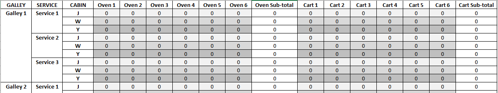

# FlyMeals - app idea

### Introduction

The mock-up of a very simple app that helps cabin crew keep track of the number of meals on an aircraft, per cabin class, service and galley. 

It may not be the next big thing, but this project has proven useful to learn more about (1) creating Multi-Index Pandas DataFrames (structured according to user input) then setting and retrieving values, (2) Python exception handling (try/except blocks), and (3) Python type annotations.

### The problem

Before each flight, a cabin crew member has to manually count the number of meals that have been loaded to the aircraft galleys by catering, and check this number against the planned service.

An aircraft has a number of galleys, each containing a number of ovens and carts. Hot meals are pre-loaded to ovens and lay-ups (chilled foods, cutlery, etc.) loaded to carts. For example, an Airbus A330-300 aircraft has 3 galleys and a flight from LHR to JFK might offer 2 services (a cold Lunch and a hot Dinner). Also, each service differs across each cabin/class code, for example, J (Upper Class), W (Premium Economy) and Y (Economy).

So for each service, in each cabin, we need to know where (that is, in which galley) our layups and hot meals are located. And we only have a few minutes to record this information - tallying up totals for each cabin, service and galley - before passengers start boarding and blocking the isles!

### Proposed solution

A simple mobile app that lets cabin crew (they each have iPads) walk through each galley, quickly recording the number of hot meals in each oven and lay-ups in each cart, and for which service and class. The input data forms a hierarchy (Cabins > Services > Galleys), which can be recorded in a table.

To set this up, we need to ask (and could save this information) for the numbers of: galleys, services and classes (and assign a code to each). We then need to know how many ovens and carts there are in each galley. Based on this, we construct a hierarchical index object - in this mockup, a multi-index Pandas DataFrame. With this in place, we can start setting and retrieving values based on user inputs and requests.

Should this be turned into a mobile app (I'd like to try with Flutter and Dart), the user might swipe between cabins, services and galleys, and see subtotals update on the fly. But for now, it's a plain old .py script.

Run the script for yourself on my Azure Notebooks project.

Example - mockup of Multi-Index DataFrame:

